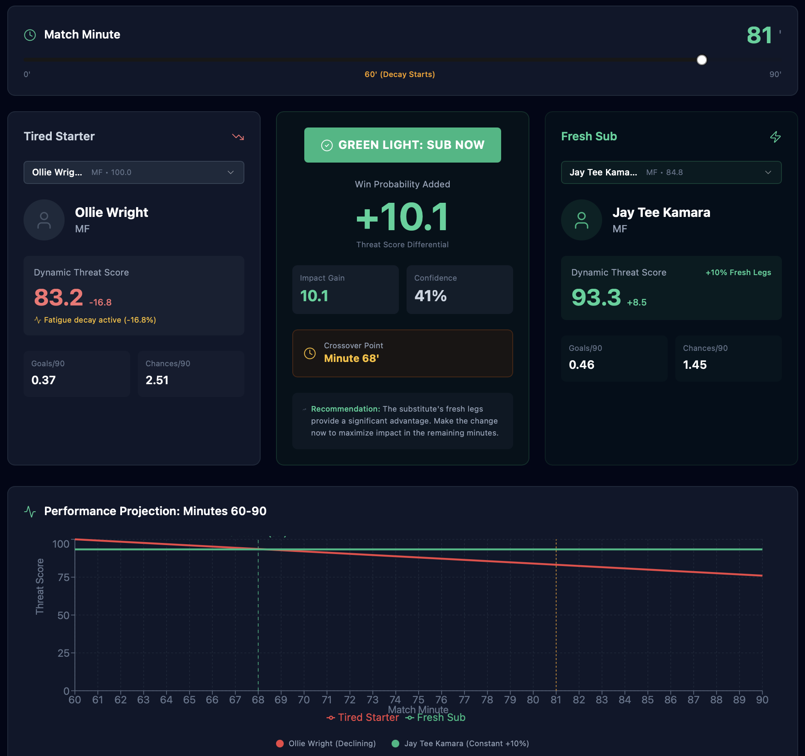

# ⚽ Portland Hearts of Pine: Player Substitution Simulator
**Predictive Performance Optimization via Base44 Logic**

## 🎯 Project Overview
This project applies predictive analytics to professional soccer (USL League One) to solve a critical coaching challenge: **When is the optimal time to substitute a starter?** Using historical performance data from the Portland Hearts of Pine inaugural season, I developed a simulator designed to predict the "Performance Decay Point" for individual players based on match-day variables.

## 📊 How it Works
The simulator uses **Base44** logic to process historical player metrics and simulate match-day fatigue. By analyzing key performance indicators, the model identifies:
* **The "Red Line":** Predicting the specific minute a player's physical output is likely to drop.
* **Positional Intensity:** Accounting for the varying metabolic demands of midfielders, wingers, and defenders.
* **Fatigue Curves:** Utilizing previous season stats to determine when a player's efficiency falls below a critical performance threshold.

### 🕒 Simulation Visual

---

## 🛠️ The Technology: Why Base44?
I utilized **Base44** for this simulator to prioritize **speed and portability** over heavy computational overhead.
* **Low Latency:** The logic is lightweight enough to be deployed on mobile devices for real-time sideline insights.
* **Dynamic Adjustments:** The engine is modular, allowing for "in-flight" adjustments to account for match-specific events like high-intensity pressing or player injuries.

---

## 🔍 Data Source & Scope
* **Data Source:** Portland Hearts of Pine (Historical Season Statistics)
* **Objective:** Transitioning from "gut-feeling" coaching to data-backed substitution strategies.
* **Stack:** Base44, Markdown, Predictive Modeling

---

## 🗂️ Project Context
This project was a "just for fun" test—as a dedicated Hearts of Pine fan—to explore sports data and experiment with **Base44** logic. 

**Current Status:** * **Experimental Phase:** This is a conceptual prototype. More historical data and rigorous testing are needed to reach production-level reliability.
* **Future Potential:** Possible implications include integrating real-time data from player health-tracking wearables (IoT) worn during matches to provide live, data-backed insights for injury prevention and stamina management.
